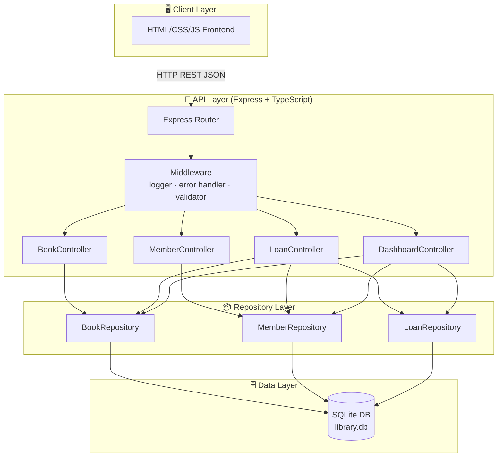
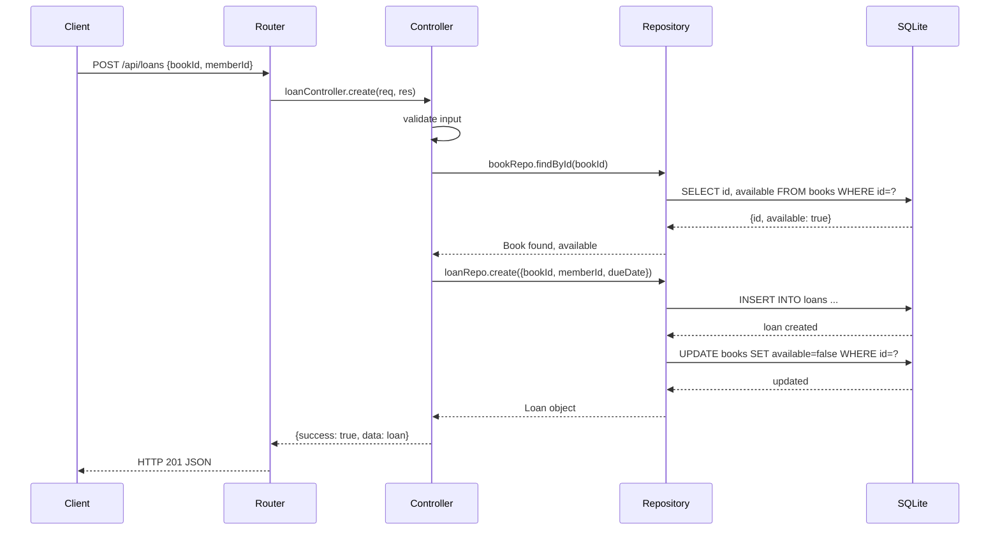
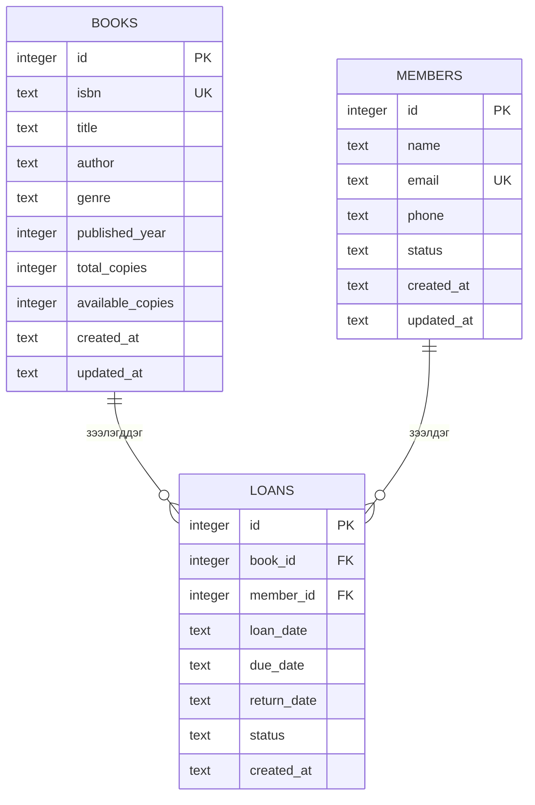

# ARCHITECTURE.md — Mini Library System

## Системийн архитектур

### Layer диаграм



### Data Flow диаграм



### Entity Relationship диаграм



## Module тодорхойлолт

### `src/routes/`
HTTP method + path-ийг controller функцтэй холбоно.
- `book.routes.ts` — `/api/books` CRUD endpoints
- `member.routes.ts` — `/api/members` CRUD endpoints
- `loan.routes.ts` — `/api/loans` зээл үүсгэх, буцаах
- `dashboard.routes.ts` — `/api/dashboard` статистик

### `src/controllers/`
HTTP request-ийг задлан авч, response буцаана. Business logic-ийн хяналт.
- Input validation
- Repository дуудах
- Зохих HTTP status + JSON response

### `src/repositories/`
Бүх SQL query энд. Controller-д SQL байхгүй.
- `BookRepository` — books CRUD + хайх
- `MemberRepository` — members CRUD + хайх
- `LoanRepository` — loans CRUD, буцаалт, хугацаа хяналт

### `src/models/`
TypeScript interface болон type тодорхойлолт.
- `Book`, `CreateBookDto`, `UpdateBookDto`
- `Member`, `CreateMemberDto`
- `Loan`, `CreateLoanDto`
- `ApiResponse<T>`

### `src/db/`
SQLite холболт болон schema migration.
- `database.ts` — DB connection singleton
- `migrations/001-initial.sql` — хүснэгтүүд үүсгэх

### `src/middleware/`
- `errorHandler.ts` — нэгдсэн error handling
- `requestLogger.ts` — HTTP request log
- `validate.ts` — input validation helper

## Folder бүтэц

```
bie-daalt-13/
├── CLAUDE.md
├── README.md
├── .gitignore
├── .claude/
│   └── commands/
│       ├── review.md
│       ├── test.md
│       ├── docs.md
│       ├── commit.md
│       └── security.md
├── partA/
│   ├── PROJECT.md
│   ├── ARCHITECTURE.md
│   ├── STACK-COMPARISON.md
│   ├── README.md
│   ├── adr/0001-stack-decision.md
│   └── ai-sessions/plan.md
├── partB/
│   ├── package.json
│   ├── tsconfig.json
│   ├── .env.example
│   ├── src/
│   │   ├── index.ts
│   │   ├── app.ts
│   │   ├── routes/
│   │   ├── controllers/
│   │   ├── repositories/
│   │   ├── models/
│   │   ├── middleware/
│   │   └── db/
│   ├── tests/
│   └── ai-sessions/
└── partC/
    ├── AI-USAGE-REPORT.md
    ├── SELF-EVALUATION.md
    └── adr/0002-decision.md
```